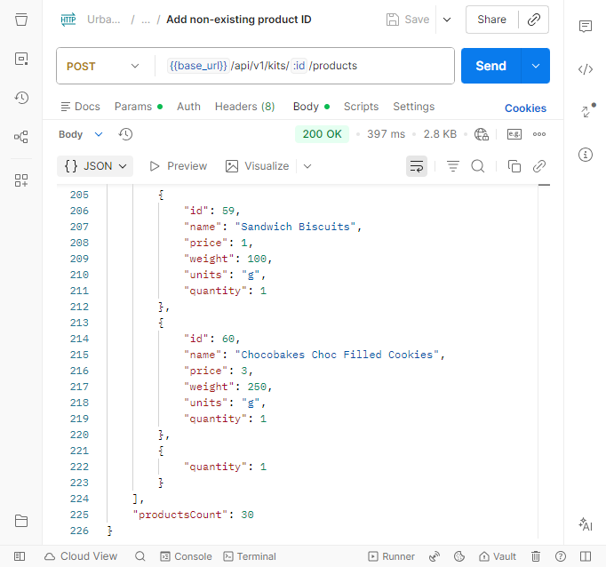
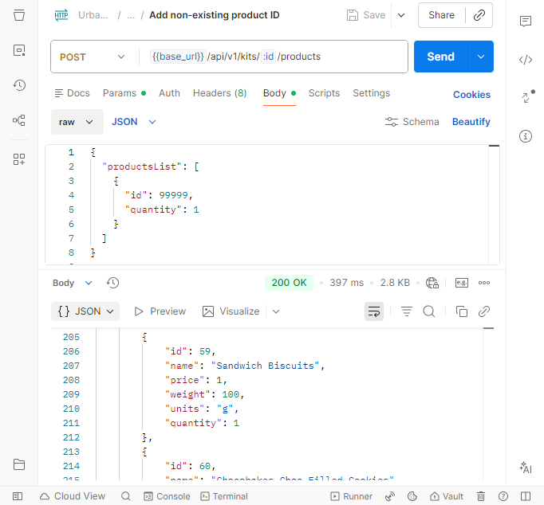

# Bug Report - USGS4-3: Non-existing Product ID Returns 200 OK

**Project:** Urban Grocers — API Testing
**Test Case Reference:** TC-API-NEG-002 (o el que corresponda)
**Reported Defect ID:** UGS4-3
Date: 2026-01-03

### **Environment:**

- Postman
- JSON REST API
- Base URL: (indica tu test environment)
- Headers: Content-Type: application/json

---

### Steps to Reproduce

1. Send POST request to URL + /api/v1/kits/:id/products
2. Use body with a non-existing product ID, for example:
   ```json
   {
   "productsList": [
    { "id": 99999,
      "quantity": 1
    }
   ]
   }
   ```
3. Observe reponse
 
 ---

 ### **Expected Result**

 The API should return:
 - **HTTP status code:** `404 Not Found`
 - A JSON error body indicanting product not found 
   Example:
   ```json
   {
   "message": "Product not found"
   }
   ```

---

### **Actual Result**
The API returns:
- HTTP status code: 200 OK
- Successful response, allowing a product that should not exist to be added
This indicates incorrect validation of product IDs.

---

### Severity
High

### Priority
Medium

---

## Notes

This behavior violates the expected API contract for invalid identifiers and could lead to data inconsistency or downstream errors if products that do not exist are accepted.

---

## Screenshot Evidence

### Request with Non-existing Product ID


### Incorrect API Response (Bug)



   
   
